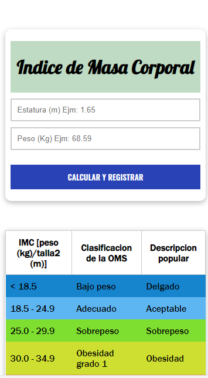
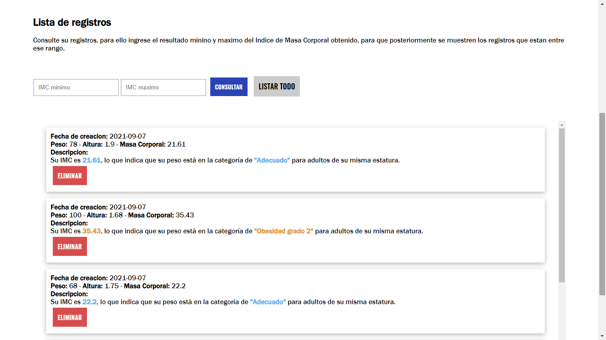
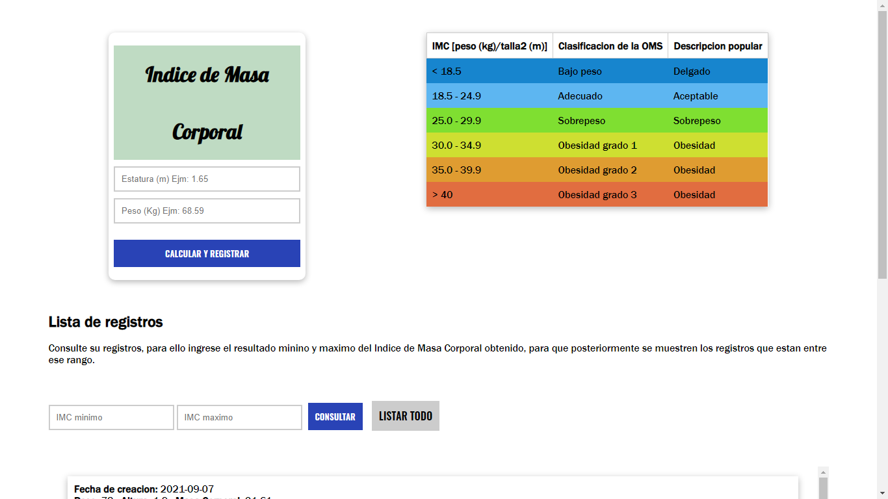

# CALCULADORA DEL INDICE DE MASA CORPORAL

## Configuraciones
Es necesario hacer unas modificaciones minimas para que funcione este mini-proyecto.

### Conexion a Base de datos
Dentro del directorio Clases/Conectar.php debera reemplazar o llenar las variables para la conexion con mysql en (phpMyAdmin, MySQL, Navicat, etc).

### Ruta base
Dentro del directorio Config/autoload.php la variable "$ruta" debera ubicar la ruta absoluta donde valla a ejecutar el proyecto.
Ejm: "http://localhost/etc......"

## Diseño de interfaz

### Movil

### Escritorio

